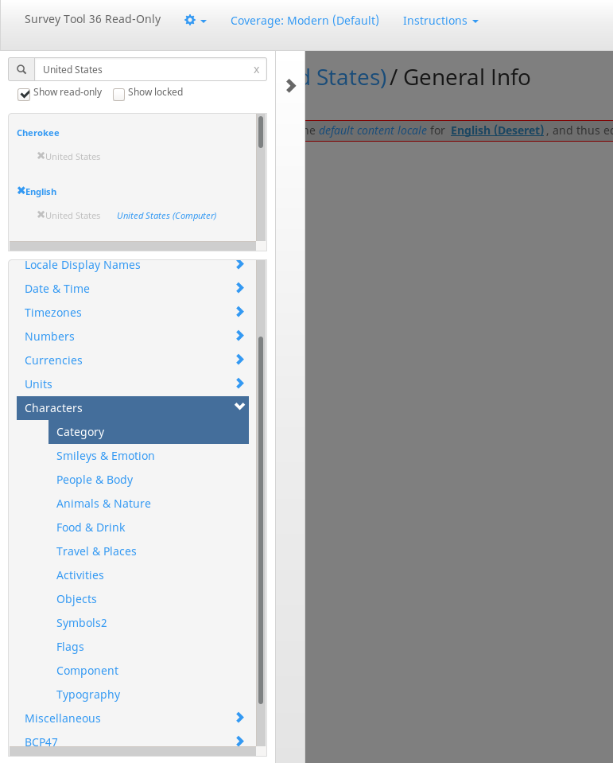

Nice to see you want to contribute! :+1:

As I do not want to duplicate the instructions all over, please **find the common contributors docs here**: https://github.com/TinyWebEx/common/blob/master/CONTRIBUTING.md

Some links and potential special rules for this repo only are listed below.

## Support us!

You like this add-on, but have no idea how to support us?

Here are some easy things you can always do:
* Spread the word and recommend it to others! 🤗😍
* Leave a rating [at addons.mozilla.org](https://addons.mozilla.org/firefox/addon/mastodon-simplified-federation/reviews/) if you like it!
  Also consider writing some text and not only leaving stars there. It's always nice to hear some warm words. ☺️
* Star this project [on GitHub](https://github.com/rugk/awesome-emoji-picker) by clicking the "star" icon!
* Leave a [review at alternativeto.net](https://alternativeto.net/software/-awesome-emoji-picker-/reviews/) and click the like button there, if you want. (Also, you can obviously recommend this add-on as an alternative to other emoji pickers.)

## Translations

* Direct link to online translator: [Web-Ext-Translator for this add-on](https://lusito.github.io/web-ext-translator/?gh=https://github.com/rugk/awesome-emoji-picker).
* English locales dir: [`src/_locales/en`](src/_locales/en)
* Text assets to translate: [`assets/texts`](assets/texts)
* Screenshots: [`assets/screenshots`](assets/screenshots)
* Wiki to translate: [wiki](/wiki)
* Sidebar file for adding language: [`_Sidebar` file](/wiki/_Sidebar/_edit)

### Translating emoji terms (categories, skin names etc.)

**Big tip** for translators: If you translate the `emojiMart*` entries, notice that you will likely find correct translations somewhere for these specific emoji terms.

Actually, it's standardized, because emojis are also standardized. It's Unicode, after all!

So the point to look for correct translations is the Unicode [Common Locale Data Repository](http://cldr.unicode.org/) (**CLDR**, see [their Wikipedia entry](https://en.wikipedia.org/wiki/Common_Locale_Data_Repository)). You can download the data there and then try to find the correct term. (I did that, and I know it's hard to find, but yes, it must be somewhere in there!)

You can also try to use [the survey tool](https://st.unicode.org/cldr-apps/v#locales///) and look in the section “Characters”:

Related:
* [discussion at emoji-mart of whether to bundle the translations inside of the library](https://github.com/missive/emoji-mart/issues/303)
* [same discussion for their upstream project emoji-data](https://github.com/iamcal/emoji-data/issues/148)

## Coding guidelines

* [editorconfig file](.editorconfig)

**Attention:** For this add-on, you need to execute [`scripts/downloadEmojiImages.sh`](scripts/downloadEmojiImages.sh) to download the bundled emoji sheets if you use anything else than the "native emojis" ("emojis from your OS") in the settings of this add-on. The reason is just, that these big files are not bundled/distributed in this repo.

### Tests

* Test dir: [`src/tests/`](src/tests/)
* EsLint config for tests: [`src/tests/.eslintrc`](src/tests/.eslintrc)
