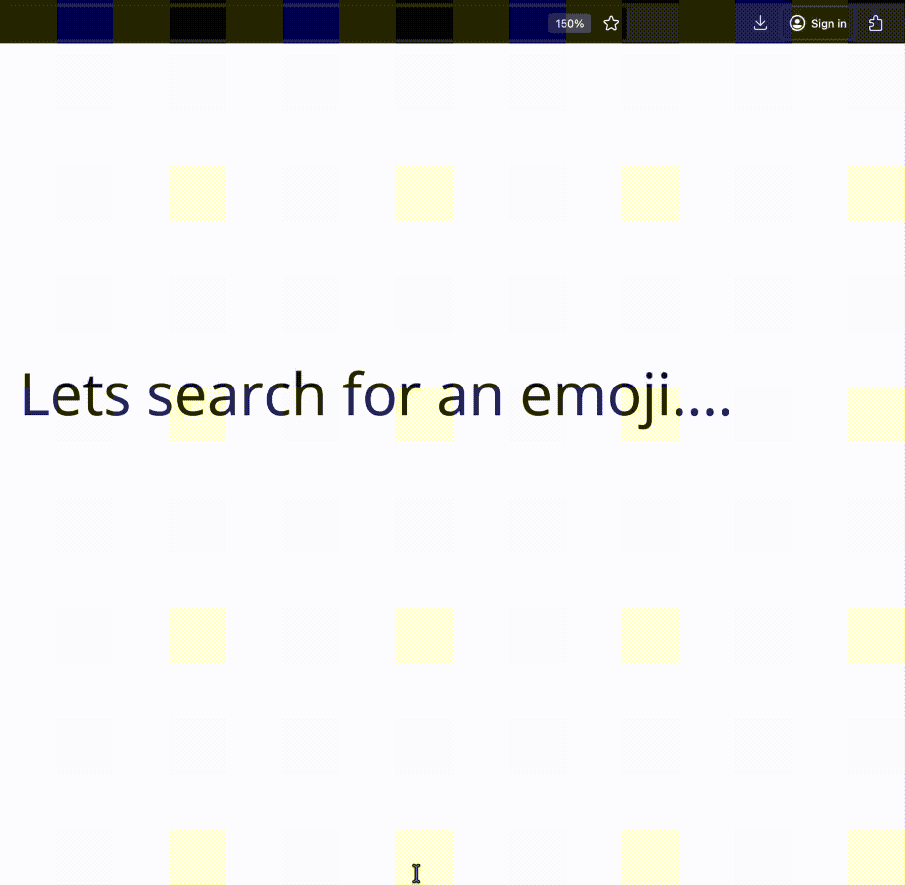

# Awesome Emoji Picker 

  

This (Firefox) add-on (WebExtension) gives you a modern emoji picker that you can use to find and select emojis (i.e. the emoticons/smileys you know from messengers such as 😃, 😎 or 🤪). It will be directly copied to your clipboard and/or inserted into the active input on the page, when you choose it.

You can then use the emojis on almost any web page, including your favorite messenger (such as WhatsApp, Telegram, Threema, Signal, Wire etc.), social media (Facebook, Instagram, Twitter, Mastodon etc.) and even e-mails.

It will remember your recently used emojis across sites, and may often be faster than the emoji picker on the site itself.

It uses up-to-date Emojis and let's you access your Emojis in different styles you know from different devices and applications. Here is a list of styles, it supports:

* Apple emojis
* Google emojis
* Twitter emojis ([Twemoji](https://twemoji.twitter.com/))
* EmojiOne emojis (now [JoyPixels](https://www.joypixels.com/))
* or just what your system/browser offers (e.g. on Windows thus Windows emojis will be used)

It is based on the awesome [emoji-mart](https://missive.github.io/emoji-mart/). You can test many features there already, before installing it.

This extension only works with Firefox v63 or higher.

The development of this add-on was also triggered, because the development of another add-on called [“Emoji Helper” or “Emoji Cheatsheet” stalled](https://github.com/johannhof/emoji-helper/issues/127).

## Download

****

## How to support us?

You don't need to be able to write code to support this project!
You can e.g. **review and like the add-on** or this GitHub repo, you can add translations or do documentation tasks.

See the [contributing guidelines](CONTRIBUTING.md) for more information on how you can help and vote for this browser extension.

In any case, spread the word and recommend it to others! 🤗😍

## In action…

See:

* [More screencasts](assets/screencasts)
* [More screenshots](assets/screenshots)

## Features

* Display the emojis in the design of Apple, Google, Twitter, EmojiOne or just the native style your browser uses.
* Quickly search for any emoji with many keywords.
* Copy emoji to your clipboard.
* …or directly insert it into the page.
* Remembers frequently used emojis.
* Emoji skin tone is adjustable and is remembered.
* You can also insert the emoji's `:colon:` syntax instead of the Unicode emoji that is used by default.
* Use the hot key (by default <kbd>Ctrl</kbd>+<kbd>Shift</kbd>+<kbd>Period</kbd>) to quickly access the emoji picker.
* Integrates into Firefox Sync, so you have all your emojis/settings on all devices.
* Adjust the style and many other options to your liking.
* The size of the whole emoji picker and the emojis itself is also adjustable.
* Use a colored toolbar icon or a decent monochrome (black/white) one.
* Follows the [Firefox Photon Design](https://design.firefox.com/photon).
* It does not violate your privacy and does send data anywhere.
* Compatible with Firefox for Android
* Translated in English and German already. [Contribute your own language!](CONTRIBUTING.md#Translations)
* Compatible with Firefox for Android
* Settings can be managed by your administrator. (see [issue #4](https://github.com/rugk/awesome-emoji-picker/issues/4))

## Contribute

You can easily get involved in this FLOSS project and any help is certainly appreciated. Here are some ideas:

* 📃 [Translate this add-on into multiple languages!](./CONTRIBUTING.md#translations)
* 🐛 [Fix some easy issues and get started in add-on development](CONTRIBUTING.md#coding) (or try out a development version)
* 💡 [Or check out some other add-on issues](CONTRIBUTING.md#need-ideas) (or translate them).

Or, in any case, [support us by spreading the word!](./CONTRIBUTING.md#support-us) ❤️
